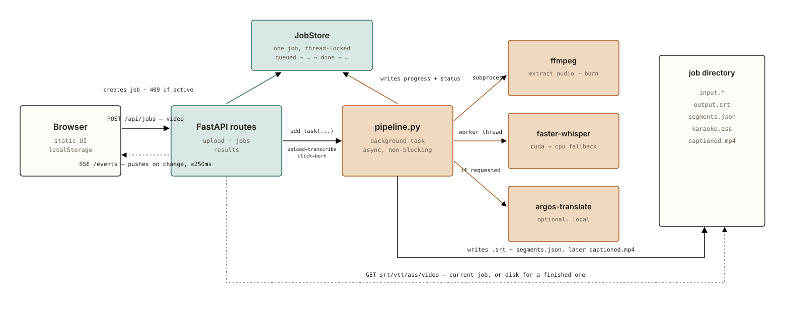

# CaptionForge

**English** | [Español](README.es.md)

Local, free automatic video captions - the CapCut/Kapwing auto-caption
experience, but 100% on your own machine. No watermark, no monthly limit,
no account.

Drag in a video, get back a `.srt` file and/or the video with subtitles
burned in, in a modern social-media style. Transcription runs locally via
[faster-whisper](https://github.com/SYSTRAN/faster-whisper); translation
(to any language, not just English) runs locally via
[argos-translate](https://github.com/argosopentech/argos-translate);
burning subtitles into the video uses [ffmpeg](https://ffmpeg.org/).
Nothing leaves your machine.

## Requirements

- Python 3.10+
- [ffmpeg](https://ffmpeg.org/download.html) on your `PATH`

## Install & run

```sh
pip install -e ".[dev]"
captionforge serve
```

This starts a local server (default `http://127.0.0.1:8420/`) and opens it
in your browser. The **ES / EN** switch in the top-right corner sets the
UI language (remembered for next time via `localStorage`; it defaults to
your browser's own language). Drag in a video, choose a Whisper model size
and optionally a source language / translation target, and click
**Generate captions**.

Once transcription finishes:

- **Download `.srt`, `.vtt`, or `.ass`** directly - the same segments,
  three formats (`.vtt` for a plain HTML `<video><track>`, `.ass` for an
  editor that wants real styling/karaoke tags).
- **Edit captions** - fix a transcription mistake before burning; timing
  never changes, only the text.
- **Pick a caption style** (Modern, TikTok bold, YouTube classic, Minimal)
  and, when word-level timing survived (untouched by translation or an
  edit), turn on **word-by-word karaoke highlighting** for the burn.
- **Burn into video** - a separate, on-demand step from transcription -
  you're never forced to re-encode the whole video just to get the text.

**Recent jobs**, below the main card, remembers your last 10 uploads in
this browser (`localStorage`) with direct re-download links for all four
formats - handy after you've moved on to a new video and the "current
job" indicator above has moved with you.

CaptionForge processes one video at a time by design - a second upload
while one is running is rejected with a clear error rather than silently
queued. Editing and re-burning are only offered for that current job;
older jobs in history are downloads only (see "Known limitations").

## Architecture

<picture>
  <source media="(prefers-color-scheme: dark)" srcset="docs/architecture-dark.svg">
  
</picture>

The upload request returns in milliseconds - the real work runs as a
background task while the browser watches it happen over a live SSE
stream, not by polling.

## How it's built

- `src/captionforge/srt.py` - pure formatting/assembly for `.srt`, `.vtt`,
  and karaoke-capable `.ass` (per-word `\k` tags when `Segment.words`
  survived translation/editing), plus the plain-dict (de)serialization used
  to persist segments to `segments.json`. No I/O.
- `src/captionforge/translate.py` - local translation of already-timed
  segments via argos-translate, decoupled from Whisper (whose own
  `task="translate"` only ever translates into English). Drops `words` on
  the translated text - the original-language per-word timing no longer
  lines up with it.
- `src/captionforge/ffmpeg_utils.py` - pure ffmpeg `argv` construction
  (audio extraction, subtitle burning) - never executes anything itself.
  `STYLE_PRESETS` (modern/tiktok/youtube/minimal) is the single source of
  truth both the plain-SRT `force_style` burn and the karaoke `.ass` burn
  render from.
- `src/captionforge/jobs.py` - an in-memory, thread-safe job state
  machine (`queued -> extracting_audio -> transcribing -> done ->
  burning_subtitles -> burned`, or `error` from anywhere). Holds ONE job
  at a time by design - `segments.json` and the output files persisted to
  disk (not this in-memory store) are what let "recent jobs" history keep
  working after a newer job takes over.
- `src/captionforge/pipeline.py` - orchestrates the above: ffmpeg runs via
  `asyncio.create_subprocess_exec`, Whisper/Argos (blocking, CPU-bound)
  run in a worker thread via `asyncio.to_thread`, so the server stays
  responsive (including the live progress stream) while a video is
  processing. Writes `segments.json` alongside the `.srt`; the karaoke burn
  path builds a `karaoke.ass` from it on demand.
- `src/captionforge/app.py` + `routes/` - the FastAPI layer: upload,
  Server-Sent Events for live progress, the `.srt`/`.vtt`/`.ass`/video
  downloads (with a disk-existence fallback for a job that's no longer the
  one JobStore is tracking - safe because CaptionForge's one-job-at-a-time
  design guarantees any older job already reached a terminal state),
  segment editing (`GET`/`PUT .../segments`, current job only), and burn
  (`style`/`karaoke` form fields).
- `src/captionforge/static/` - the frontend: one plain HTML/CSS/JS page,
  no build step, no framework. `i18n.js` is a small flat-dictionary
  translator (Spanish/English, `localStorage`-backed) that drives every
  `data-i18n`-tagged element in `index.html`; job stage labels are derived
  client-side from the language-neutral `status` field the API already
  returns, not from the backend's own (Spanish-only) `stage_label` text.

`scripts/smoke_test_pipeline.py` exercises the whole transcribe ->
translate -> burn pipeline directly against a real video, no server
involved - the fastest way to sanity-check the core after touching
anything Whisper/ffmpeg/Argos-related.

## Development

```sh
python -m venv .venv
source .venv/Scripts/activate   # or .venv/bin/activate on Linux/macOS
pip install -e ".[dev]"
pytest
```

`tests/fixtures/tiny_test_clip.mp4` is a real ~10s clip (synthesized
speech) used by the live-pipeline tests - not a mock.

## Known limitations

- `argos-translate`'s default `compute_type="auto"` resolves to a quantized
  kernel that silently produces garbage (repetition-loop) output for at
  least one language pair on at least one real CPU - verified live during
  development. `captionforge` forces `float32` (see `translate.py`) to
  avoid this; if you use `argos-translate` directly elsewhere, verify your
  own language pair isn't affected before trusting quantized output.
- The UI language switch is frontend-only. Everyday status text (stage
  labels, generic error framing) is fully bilingual, but the rare
  server-generated error message - an unsupported file format, a job
  conflict, an ffmpeg failure - is still written in Spanish by the backend
  and shown as-is regardless of the selected UI language.
- Editing captions and re-burning are only available for the CURRENT job -
  once a new upload starts, JobStore forgets the old one (by design; see
  jobs.py), so an older job in "recent jobs" offers downloads only. This
  matches the natural flow (transcribe -> optionally edit -> burn) and
  the one-job-at-a-time state machine, which has no path back from BURNED.
- Karaoke highlighting needs word-level timing, which is dropped for any
  segment that was translated or manually edited (the words no longer line
  up with the new text) - the karaoke checkbox is simply hidden when no
  segment has it, and still works for whichever segments do.
- "Recent jobs" lives in `localStorage`, so it's private to one browser -
  it does not survive clearing site data and is never shared between
  devices.
- A job's files (video, `.srt`/`.vtt`/`.ass`, `segments.json`) are deleted
  automatically 7 days after they were last written - each new upload
  prunes anything past that age. An entry can outlive its files in "recent
  jobs" (which has no expiry of its own); its download links just 404 once
  that happens.

## Roadmap

Ideas worth doing eventually, deliberately not started yet:

- **A packaged native installer** (Windows `.exe`, macOS `.dmg`, Linux
  `.AppImage`/`.deb`) so a user doesn't need Python or ffmpeg pre-installed
  - bundle the Python runtime (including `faster-whisper`'s native
  CTranslate2 library) and a static ffmpeg binary into one executable via
  something like PyInstaller, the way Ollama ships a single binary. The
  real cost isn't the bundling itself but per-OS GPU/CUDA detection and
  code-signing (to avoid Windows SmartScreen / macOS Gatekeeper warnings) -
  comparable in effort to building the app itself, which is why it's out
  of v1 on purpose.
- **A hosted version** - CaptionForge needs real CPU (or GPU) for
  Whisper/ffmpeg, so a free-tier host isn't enough for serious use; a paid
  host is the realistic next step if there's ever demand for a
  "no-install-at-all" option. See "Support this project" below.

## Support this project

CaptionForge is free and local by design, and will stay that way. A tip
doesn't unlock anything - it goes toward eventually paying for a real host,
so people who don't want to install anything have a "no-install-at-all"
option too:

- **Ko-fi:** [ko-fi.com/bryandero98](https://ko-fi.com/bryandero98)
- **USDT (TRC20):** `TEG4Kk2qXYMQ4mHNd7dPhSPRyT14CGr2or` - double-check the
  network is set to **TRC20** before sending; a transfer on the wrong
  network can't be recovered.

## Ideas & contributions

Suggestions for what CaptionForge should do next are welcome, not just bug
reports - open an issue with what you'd want, even a rough one. See
[CONTRIBUTING.md](./CONTRIBUTING.md) for how to send a PR.
